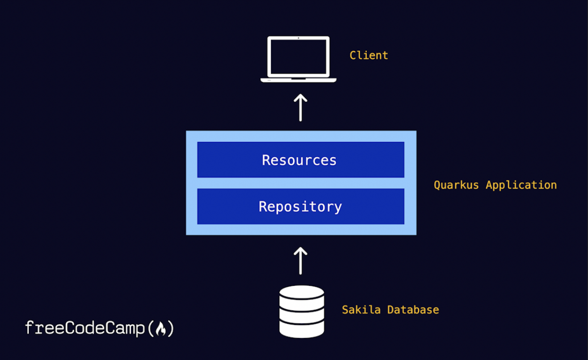
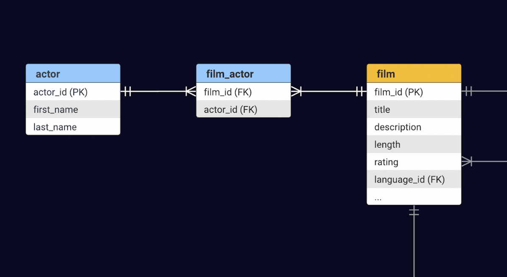

= freeCodeCamp Tutorial - Getting Started with Quarkus and JPAStreamer

This repository contains the complete source code for the application built in the freeCodeCamp tutorial "Gatting Started with Quarkus and JPAStreamer".

== Prerequisites
- Java 11 or later
- Docker
- Sakila database running in a Docker container, see instructions xref:database[here].

== Application overview

[#database]
== Database
The application makes use of the link:https://dev.mysql.com/doc/sakila/en/[MySQL Sakila sample database]. To download and run it as a Docker container on port 3306, run: 

[shell script]
----
$ docker run -d --publish 3306:3306 --name mysqld restsql/mysql-sakila
----

NOTE: This Docker image was built for ARM64 architecture, thus if you are running on e.g. an M1 Mac, you need to instruct Docker to accept images built for a different platform by appending the flag `--platform linux/amd64` after `docker run` in the above command. 

Here is an overview of the relevant part of the schema: 

== Running the application in dev mode
You can run your application in dev mode that enables live coding using:

[source, shell]
----
./mvnw compile quarkus:dev
----

NOTE: The Quarkus Dev UI is available in dev mode only at link:http://localhost:8080/q/dev/[http://localhost:8080/q/dev/].

NOTE: To test your endpoints using Swagger, visit link:http://localhost:8080/q/swagger-ui/[http://localhost:8080/q/swagger-ui/].

== Packaging and running the application
The application can be packaged using:

[source, shell]
----
./mvnw package
----

It produces the `quarkus-run.jar` file in the `target/quarkus-app/` directory.

NOTE: Be aware that it’s not an _über-jar_ as the dependencies are copied into the `target/quarkus-app/lib/` directory.

The application is now runnable using `java -jar target/quarkus-app/quarkus-run.jar`.

If you want to build an _über-jar_, execute the following command:

[source, shell]
----
./mvnw package -Dquarkus.package.type=uber-jar
----

The application, packaged as an _über-jar_, is now runnable using `java -jar target/*-runner.jar`.

=== Creating a native executable

You can create a native executable using: 

[source, shell]
----
./mvnw package -Pnative
----

Or, if you don't have GraalVM installed, you can run the native executable build in a container using: 

[source, shell]
----
./mvnw package -Pnative -Dquarkus.native.container-build=true
----

You can then execute your native executable with: `./target/quarkus-tutorial-1.0.0-SNAPSHOT-runner`

If you want to learn more about building native executables, please consult link:https://quarkus.io/guides/maven-tooling[Maven tooling].

== Video Tutorial 
TODO: Insert link here

== Blog Article
TODO: Insert link here

== Related Resources
- link:https://quarkus.io/guides/[Quarkus Guides]
- link:https://code.quarkus.io/[Quarkus Project Configurator]
- link:https://speedment.github.io/jpa-streamer/jpa-streamer/latest[JPAStreamer Docs]
- link:https://quarkus.io/guides/hibernate-orm-panache[Hibernate ORM with Panache] 
- link:https://dev.mysql.com/doc/sakila/en/[Sakila Database] 

